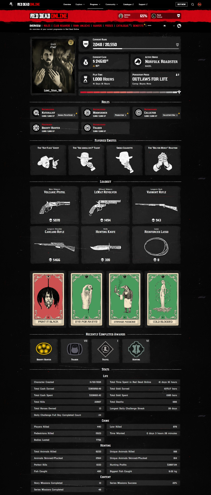

# Red Dead Online

### **Multiplayer: Red Dead Online**

*Red Dead Redemption 2* includes a multiplayer component, *Red Dead Online*, which launched shortly after the main game. This mode allows players to immerse themselves in the same richly detailed world as the single-player campaign, but alongside other players. While the online experience shares many gameplay mechanics with the single-player mode, it offers a sandbox-style environment where players can forge their own stories and adventures.

### **Initial Reception and Evolution**

When *Red Dead Online* debuted in 2018, it was met with mixed reactions. Players praised its potential but criticized its lack of content, balance issues, and monetization practices. Over time, Rockstar addressed these issues by introducing substantial updates, expanding gameplay options, and improving the overall experience.

1. **Early Issues:**
    - **Lack of Content:** At launch, *Red Dead Online* felt sparse, with limited activities and a lack of direction for players.
    - **Economy Imbalance:** Players noted that earning in-game currency felt grind-heavy, with gold bars (premium currency) dominating progression.
    - **Bugs and Stability:** As with many online launches, technical issues like server instability and glitches were common.
2. **Improvements Over Time:**
    - Regular updates introduced new missions, activities, and customization options, enriching the multiplayer experience.
    - Roles and professions allowed for more structured gameplay, catering to a variety of playstyles.

### **Roles and Professions**

*Red Dead Online* introduced a structured role system, giving players unique ways to interact with the world:

1. **Bounty Hunter:**
    - Players track down wanted criminals or other players for rewards.
    - Advanced bounty targets add complexity, such as pursuing groups or time-sensitive captures.
2. **Trader:**
    - Players operate their own business, gathering materials through hunting and crafting to sell goods.
    - This role emphasizes resource management and teamwork, as deliveries can be ambushed by other players.
3. **Collector:**
    - A role cantered around exploration, where players search for valuable items like tarot cards, heirlooms, and coins.
    - This role is ideal for players who enjoy scavenger hunts and a slower pace.
4. **Naturalist:**
    - Players study and interact with the wildlife, either capturing animals for research or hunting them for rewards.
    - This role encourages players to engage with the world’s ecosystem in a less combat-focused way.
5. **Moonshiner:**
    - Players run an illegal distillery, crafting and selling moonshine while evading law enforcement.
    - This role combines elements of trading with narrative-driven missions.

### **Gameplay in *Red Dead Online***

The core gameplay mirrors the single-player mode, offering a mix of exploration, combat, and activities, but with added multiplayer dynamics.

- **Dynamic Events:**
Players encounter random events, such as ambushes, rescues, or challenges, fostering unpredictable interactions.
- **Cooperative Missions:**
Narrative-driven missions, like “A Land of Opportunities,” allow players to team up and experience stories tailored to the online mode.
- **Competitive Modes:** *Red Dead Online* features competitive modes like races, team deathmatches, and free-for-all showdowns.

### **Social and Community Dynamics**

Interacting with other players is a key element of *Red Dead Online,* offering both cooperation and conflict:

1. **Posse System:**
    - Players can form or join posses (groups) to tackle challenges together, enhancing teamwork and camaraderie.
    - Large posses allow for coordinated efforts in events, roles, and battles.
2. **Player Interaction:**
    - The open-world design means players can encounter each other freely, leading to a mix of friendly exchanges and PvP encounters.
    - Players can engage in duels, ambushes, or truce negotiations, creating emergent stories unique to the multiplayer experience.
3. **Griefing and Hostility:**
    - One downside is player griefing, where some players repeatedly harass others. Rockstar addressed this by introducing features like defensive mode, which limits unwanted aggression.

### **Strengths of *Red Dead Online***

1. **Immersive World:**
    - The same level of detail and authenticity from the single-player mode carries over to the online environment, making it one of the most visually and mechanically impressive multiplayer experiences.
2. **Freedom and Customization:**
    - Players can tailor their experience, from roleplay as an outlaw or law-abiding trader to customizing their character, camp, and equipment.
3. **Endless Replay ability:**
    - The open-ended structure allows players to set their own goals, whether it’s amassing wealth, completing roles, or simply exploring.

### **Criticisms and Limitations**

Despite its strengths, *Red Dead Online* has faced persistent criticism:

1. **Monetization:**
    - The heavy reliance on microtransactions for gold bars has frustrated players, as some items and upgrades feel overly expensive in in-game currency.
2. **Lack of Narrative Depth:**
    - While cooperative missions provide some story elements, they lack the emotional weight and character development of the single-player campaign.
3. **Slow Updates in Later Years:**
    - While early updates were frequent and robust, Rockstar shifted focus to *Grand Theft Auto Online,* leading to slower updates for *Red Dead Online.*
    - Fans expressed disappointment at Rockstar’s lack of long-term commitment to expanding the game.

### **Legacy and Current State**

Despite its shortcomings, *Red Dead Online* remains a unique multiplayer experience, offering a beautifully realized world, a variety of roles, and engaging mechanics. However, its reliance on player-driven stories and the lack of consistent support from Rockstar have left it overshadowed by its single-player counterpart and Rockstar’s other online juggernaut, *GTA Online.*

For players who enjoy immersive multiplayer experiences and open-ended gameplay, *Red Dead Online* offers endless opportunities for creativity and exploration, even if it falls short of fulfilling its full potential.

> **My Profile**
> 

